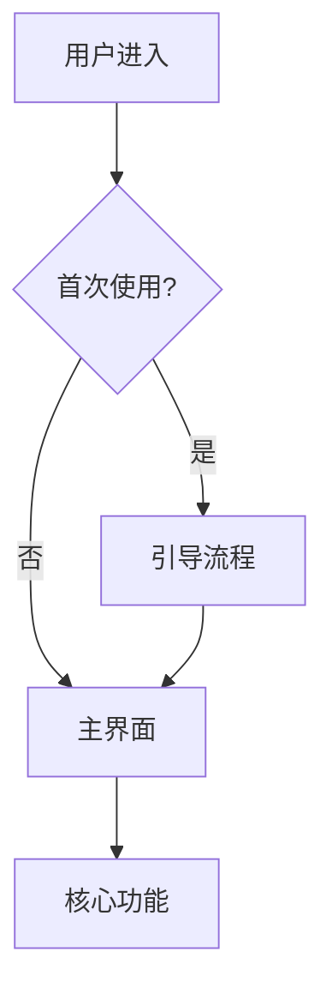
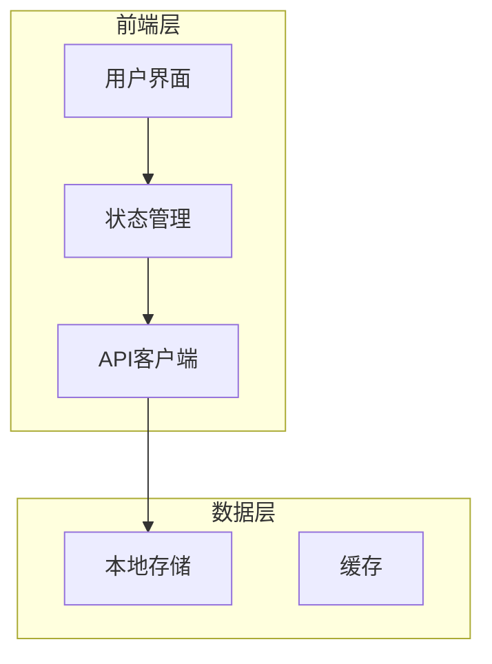
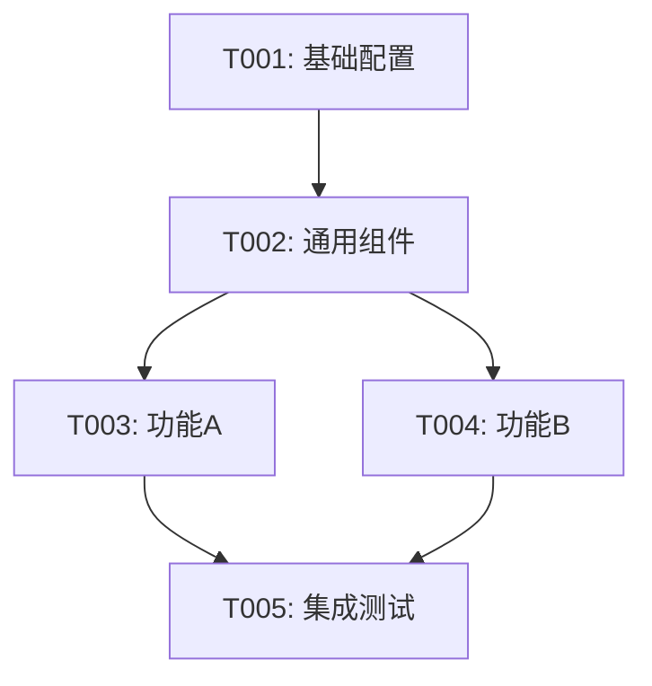

# Claude Code Agent 系统设计
## 基于 GPT-Pilot 的通用开发代理框架

---

## 系统概述

这个系统通过自定义命令激活不同角色的 Agent，每个 Agent 都有预定义的职责和提示词模板，接收用户输入后自动执行相应的工作流程。

### 核心 Agents

```
/product-owner    → 产品负责人（需求分析）
/architect        → 软件架构师（技术设计）
/tech-lead        → 技术主管（任务分解）
/developer        → 开发工程师（功能实现）
/tester           → 测试工程师（质量保证）
/reviewer         → 代码审查员（代码审查）
/debugger         → 调试专家（问题解决）
```

---

## 实现方案

### 方案 1: Claude Code Hooks（推荐）

利用 Claude Code 2.0 的 hooks 系统实现自定义命令。

### 方案 2: Shell 脚本包装器

创建包装脚本拦截命令并注入提示词。

### 方案 3: MCP Server（高级）

开发 Model Context Protocol 服务器提供专业化工具。

---

## 方案 1 实现：Claude Code Hooks

### 步骤 1: 创建 Agent 配置系统

**创建目录结构**：

```bash
mkdir -p .claude/agents
mkdir -p .claude/templates
mkdir -p .claude/hooks
```

**创建 Agent 定义文件**：

```bash
cat > .claude/agents/agents.json << 'EOF'
{
  "agents": {
    "product-owner": {
      "name": "产品负责人",
      "emoji": "🎯",
      "description": "负责需求收集、分析和产品规格说明",
      "template": "product-owner.md",
      "inputs": ["project_description"],
      "outputs": ["product_requirements.md", "CLAUDE.md"],
      "next_agent": "architect"
    },
    "architect": {
      "name": "软件架构师",
      "emoji": "🏗️",
      "description": "负责技术选型、架构设计和项目初始化",
      "template": "architect.md",
      "inputs": ["product_requirements"],
      "outputs": ["architecture.md", "package.json"],
      "dependencies": ["product-owner"],
      "next_agent": "tech-lead"
    },
    "tech-lead": {
      "name": "技术主管",
      "emoji": "📋",
      "description": "负责任务分解、优先级排序和开发计划",
      "template": "tech-lead.md",
      "inputs": ["product_requirements", "architecture"],
      "outputs": ["tasks.md", "task_status.json"],
      "dependencies": ["architect"],
      "next_agent": "developer"
    },
    "developer": {
      "name": "开发工程师",
      "emoji": "💻",
      "description": "负责功能实现，使用TDD方式开发",
      "template": "developer.md",
      "inputs": ["task_id"],
      "outputs": ["code", "tests"],
      "dependencies": ["tech-lead"],
      "next_agent": "tester"
    },
    "tester": {
      "name": "测试工程师",
      "emoji": "🧪",
      "description": "负责编写测试用例和质量保证",
      "template": "tester.md",
      "inputs": ["task_id", "code"],
      "outputs": ["test_files", "test_report"],
      "dependencies": ["developer"],
      "next_agent": "reviewer"
    },
    "reviewer": {
      "name": "代码审查员",
      "emoji": "👀",
      "description": "负责代码审查和质量把关",
      "template": "reviewer.md",
      "inputs": ["task_id", "changed_files"],
      "outputs": ["review_report", "commit_message"],
      "dependencies": ["tester"],
      "next_agent": null
    },
    "debugger": {
      "name": "调试专家",
      "emoji": "🔧",
      "description": "负责问题诊断和Bug修复",
      "template": "debugger.md",
      "inputs": ["error_description", "error_logs"],
      "outputs": ["diagnosis", "fix"],
      "dependencies": [],
      "next_agent": null
    }
  },
  "workflow": {
    "default": [
      "product-owner",
      "architect", 
      "tech-lead",
      "developer",
      "tester",
      "reviewer"
    ],
    "hotfix": [
      "debugger",
      "tester",
      "reviewer"
    ]
  }
}
EOF
```

### 步骤 2: 创建 Agent 提示词模板

#### Product Owner Template

```bash
cat > .claude/templates/product-owner.md << 'EOF'
# 🎯 产品负责人 Agent

你现在是一位经验丰富的产品负责人，负责帮助用户明确产品需求。

## 用户输入
项目描述：{{PROJECT_DESCRIPTION}}

## 你的任务

### 第一阶段：需求分析和提问

请仔细分析用户的项目描述，然后提出 **5-7 个关键问题** 来澄清需求。

**提问领域**：
1. **目标用户和场景**
   - 谁是主要用户？
   - 在什么场景下使用？
   - 解决什么问题？

2. **核心功能和优先级**
   - 最重要的功能是什么？
   - MVP（最小可行产品）包含哪些功能？
   - 哪些是未来版本的功能？

3. **技术和平台**
   - 期望的应用类型（Web/Desktop/Mobile/CLI）？
   - 是否有技术栈偏好？
   - 性能和规模要求？

4. **数据和存储**
   - 需要存储哪些数据？
   - 数据持久化要求？
   - 是否需要用户账户系统？

5. **用户体验**
   - 界面风格偏好？
   - 交互方式？
   - 可访问性要求？

6. **集成和扩展**
   - 是否需要与其他系统集成？
   - 未来的扩展方向？

**输出格式**：
```
## 📝 需求澄清问题

为了更好地理解你的需求，我需要了解以下信息：

### 关于用户和场景
1. [问题1]

### 关于功能和优先级
2. [问题2]
3. [问题3]

### 关于技术平台
4. [问题4]

### 关于数据存储
5. [问题5]

### 关于用户体验
6. [问题6]

### 关于其他
7. [问题7]

请一次性回答所有问题，我会根据你的答案生成详细的产品需求文档。
```

---

### 第二阶段：生成需求文档

用户回答问题后，请执行以下操作：

1. **总结核心功能**
   - 按优先级排序
   - 区分 MVP 和未来功能
   - 标记依赖关系

2. **定义非功能性需求**
   - 性能要求
   - 安全要求
   - 可用性要求

3. **绘制用户流程**
   - 使用 Mermaid 图表
   - 展示主要用户旅程

4. **创建需求文档**
   - 保存为 `docs/product_requirements.md`
   - 使用清晰的结构和格式

5. **更新项目配置**
   - 更新 `CLAUDE.md` 添加项目概述
   - 记录重要决策到 `.claude/context_memory.json`

**需求文档模板**：

```markdown
# {{PROJECT_NAME}} - 产品需求文档

## 1. 项目概述

### 1.1 项目简介
[简要描述项目]

### 1.2 目标用户
[描述目标用户群体]

### 1.3 核心价值
[解决什么问题，提供什么价值]

## 2. 功能需求

### 2.1 MVP 功能（必需）

#### F1: [功能名称]
- **描述**: [详细描述]
- **用户故事**: 作为[角色]，我想要[功能]，以便[目的]
- **验收标准**:
  - [ ] 标准1
  - [ ] 标准2
- **优先级**: 高

[重复其他MVP功能...]

### 2.2 未来功能（可选）
[列出V2、V3版本功能]

## 3. 非功能性需求

### 3.1 性能要求
- 页面加载时间: < X秒
- 响应时间: < X毫秒
- 并发用户: X人

### 3.2 安全要求
[安全相关需求]

### 3.3 可用性要求
[可访问性、兼容性等]

## 4. 用户流程



## 5. 数据模型（初步）

### 实体1
- 字段1: 类型
- 字段2: 类型

## 6. 技术约束
- 浏览器兼容性
- 设备支持
- 第三方服务

## 7. 里程碑

| 里程碑 | 功能范围 | 预计时间 |
|--------|---------|---------|
| MVP | [功能列表] | X周 |
| V1.1 | [功能列表] | X周 |

## 8. 风险和假设

### 风险
1. [风险1]

### 假设
1. [假设1]

---

**文档版本**: 1.0
**创建日期**: {{DATE}}
**负责人**: Product Owner Agent
```

---

## 完成检查

完成后，请确认：

- [x] 所有问题都得到回答
- [x] 创建了 `docs/product_requirements.md`
- [x] 更新了 `CLAUDE.md`
- [x] 记录了关键决策

**下一步建议**：
```
需求文档已完成！下一步请运行：
/architect

这将启动架构师 Agent 进行技术设计。
```
EOF
```

#### Architect Template

```bash
cat > .claude/templates/architect.md << 'EOF'
# 🏗️ 软件架构师 Agent

你现在是一位经验丰富的软件架构师，负责技术选型和系统设计。

## 输入文档
- 产品需求: {{PRODUCT_REQUIREMENTS}}

## 你的任务

### 第一阶段：技术栈推荐

基于产品需求，提供 **2-3 个技术栈方案**。

**考虑因素**：
- 项目类型和规模
- 性能要求
- 开发效率
- 团队技能
- 社区支持
- 长期维护

**方案模板**：

```
## 🔧 技术栈方案

### 方案 1: [名称] （推荐）

**前端**：
- 框架: [React/Vue/Svelte/...]
- 语言: [TypeScript/JavaScript]
- 样式: [Tailwind/CSS Modules/Styled-Components]
- 构建: [Vite/Webpack]

**后端** (如果需要)：
- 运行时: [Node.js/Deno/Bun]
- 框架: [Express/Fastify/NestJS]
- 数据库: [PostgreSQL/MongoDB/SQLite]

**测试**：
- 单元测试: [Vitest/Jest]
- E2E测试: [Playwright/Cypress]

**工具链**：
- 包管理: [npm/pnpm/yarn]
- 代码规范: [ESLint + Prettier]
- Git hooks: [Husky + lint-staged]

**优势**：
- ✅ [优势1]
- ✅ [优势2]

**劣势**：
- ⚠️ [劣势1]

**适用场景**：[描述]

---

### 方案 2: [名称]
[类似结构...]

### 方案 3: [名称]
[类似结构...]

请选择一个方案，或告诉我你的偏好，我将基于你的选择继续。
```

---

### 第二阶段：架构设计

用户选择方案后，设计详细架构。

#### 1. 系统架构图

使用 Mermaid 创建架构图：



#### 2. 项目结构设计

```
project-root/
├── src/
│   ├── components/          # UI组件
│   │   ├── common/         # 通用组件
│   │   └── features/       # 功能组件
│   ├── hooks/              # 自定义Hooks
│   ├── utils/              # 工具函数
│   ├── services/           # API服务
│   ├── store/              # 状态管理
│   ├── types/              # TypeScript类型
│   ├── styles/             # 样式文件
│   └── App.tsx             # 应用入口
├── tests/
│   ├── unit/               # 单元测试
│   └── e2e/                # 端到端测试
├── docs/                   # 文档
├── public/                 # 静态资源
└── scripts/                # 构建脚本
```

#### 3. 数据模型设计

基于需求文档，设计详细的数据模型：

```typescript
// 示例：数据类型定义
interface Entity {
  id: string;
  // ... 字段定义
}
```

#### 4. 关键决策记录

记录重要的架构决策：

```markdown
## 架构决策记录 (ADR)

### ADR-001: 选择 React + TypeScript
**日期**: {{DATE}}
**状态**: 已采纳
**决策**: 使用 React 18 + TypeScript
**理由**: 
- 类型安全
- 丰富的生态系统
- 团队熟悉度高
**后果**: 需要配置 TypeScript 工具链
```

---

### 第三阶段：项目初始化

执行以下操作：

#### 1. 创建配置文件

生成所有必需的配置文件：

- `package.json` - 项目元数据和依赖
- `tsconfig.json` - TypeScript配置
- `vite.config.ts` - 构建配置
- `tailwind.config.js` - 样式配置
- `.eslintrc.json` - 代码规范
- `.prettierrc` - 代码格式化
- `.gitignore` - Git忽略规则

#### 2. 创建目录结构

```bash
# 使用 bash tool 创建目录
mkdir -p src/{components/{common,features},hooks,utils,services,store,types,styles}
mkdir -p tests/{unit,e2e}
mkdir -p public/{images,fonts}
mkdir -p docs/{api,guides}
```

#### 3. 安装依赖

```bash
# 使用 bash tool 安装依赖
npm install [依赖列表]
npm install -D [开发依赖列表]
```

#### 4. 创建基础文件

- `src/App.tsx` - 应用入口（基础结构）
- `src/main.tsx` - 挂载点
- `src/vite-env.d.ts` - Vite类型声明
- `index.html` - HTML模板

#### 5. 设置开发脚本

在 `package.json` 中配置：

```json
{
  "scripts": {
    "dev": "vite",
    "build": "tsc && vite build",
    "preview": "vite preview",
    "test": "vitest",
    "test:ui": "vitest --ui",
    "test:coverage": "vitest --coverage",
    "lint": "eslint . --ext ts,tsx",
    "lint:fix": "eslint . --ext ts,tsx --fix",
    "format": "prettier --write \"src/**/*.{ts,tsx,css}\"",
    "type-check": "tsc --noEmit"
  }
}
```

---

### 第四阶段：生成架构文档

创建 `docs/architecture.md`：

```markdown
# {{PROJECT_NAME}} - 系统架构文档

## 1. 技术栈

[详细列出选择的技术栈及版本]

## 2. 系统架构

[架构图和说明]

## 3. 目录结构

[详细的目录结构说明]

## 4. 数据模型

[数据实体和关系]

## 5. 关键设计

### 5.1 状态管理策略
[说明]

### 5.2 路由设计
[说明]

### 5.3 API设计
[说明]

## 6. 开发规范

### 6.1 代码规范
- 使用 TypeScript 严格模式
- 组件命名: PascalCase
- 文件命名: kebab-case
- 函数命名: camelCase

### 6.2 提交规范
遵循 Conventional Commits:
- feat: 新功能
- fix: Bug修复
- docs: 文档更新
- style: 代码格式
- refactor: 重构
- test: 测试
- chore: 构建/工具

### 6.3 测试规范
- 单元测试覆盖率 > 80%
- 关键路径必须有E2E测试

## 7. 部署架构

[部署方案说明]

## 8. 架构决策记录

[列出所有ADR]

---

**文档版本**: 1.0
**创建日期**: {{DATE}}
**负责人**: Architect Agent
```

---

### 第五阶段：更新项目配置

更新 `CLAUDE.md`：

```markdown
# {{PROJECT_NAME}}

## 项目概述
[从需求文档复制]

## 技术栈
[列出技术栈]

## 架构说明
[简要架构说明，详见 docs/architecture.md]

## 开发指南

### 安装依赖
\`\`\`bash
npm install
\`\`\`

### 运行开发服务器
\`\`\`bash
npm run dev
\`\`\`

### 运行测试
\`\`\`bash
npm test
\`\`\`

### 构建生产版本
\`\`\`bash
npm run build
\`\`\`

## 项目结构
[目录说明]

## 开发规范
[引用架构文档]

## 重要文件
- `docs/product_requirements.md` - 产品需求
- `docs/architecture.md` - 架构设计
- `tasks.md` - 任务列表

---

**最后更新**: {{DATE}}
```

---

## 完成检查

- [x] 技术栈已选择
- [x] 架构图已创建
- [x] 项目结构已建立
- [x] 依赖已安装
- [x] 配置文件已生成
- [x] 架构文档已创建
- [x] CLAUDE.md 已更新
- [x] 项目可以运行 `npm run dev`

**验证步骤**：
```bash
# 1. 检查依赖
npm list --depth=0

# 2. 类型检查
npm run type-check

# 3. Lint检查
npm run lint

# 4. 启动开发服务器
npm run dev
```

**下一步建议**：
```
架构设计已完成！下一步请运行：
/tech-lead

这将启动技术主管 Agent 进行任务分解。
```
EOF
```

#### Tech Lead Template

```bash
cat > .claude/templates/tech-lead.md << 'EOF'
# 📋 技术主管 Agent

你现在是一位经验丰富的技术主管，负责任务分解和开发计划。

## 输入文档
- 产品需求: {{PRODUCT_REQUIREMENTS}}
- 系统架构: {{ARCHITECTURE}}

## 你的任务

### 任务分解原则

1. **粒度适中**: 每个任务 2-4 小时完成
2. **依赖清晰**: 明确任务间的依赖关系
3. **可测试性**: 每个任务都有验收标准
4. **独立性**: 尽量减少任务间耦合
5. **优先级**: 区分 MVP 和增强功能

### 任务分类

- 🏗️ **基础设施**: 项目配置、工具设置、CI/CD
- 🎨 **UI组件**: 可复用的界面组件
- ⚙️ **核心功能**: 业务逻辑实现
- 💾 **数据层**: 状态管理、存储、API
- 🧪 **测试**: 单元测试、集成测试、E2E测试
- 📖 **文档**: API文档、用户指南、开发文档

---

## 任务生成流程

### 步骤 1: 分析需求和架构

阅读产品需求文档和架构文档，识别：
- 所有功能点
- 技术组件
- 依赖关系
- 风险点

### 步骤 2: 生成任务列表

为每个功能点创建任务，使用以下模板：

```json
{
  "id": "T001",
  "title": "设置项目基础配置",
  "category": "基础设施",
  "priority": "高",
  "estimated_hours": 2,
  "status": "pending",
  "dependencies": [],
  "description": "详细描述任务要做什么，为什么做，以及如何验证完成。",
  "acceptance_criteria": [
    "项目可以运行 npm run dev",
    "ESLint 和 Prettier 正常工作",
    "TypeScript 编译无错误"
  ],
  "files_to_create": [
    "src/App.tsx",
    "src/main.tsx"
  ],
  "files_to_modify": [
    "package.json",
    "CLAUDE.md"
  ],
  "test_requirements": "无需测试（配置任务）",
  "technical_notes": "使用 Vite 作为构建工具，确保支持 TypeScript 和热更新。",
  "tags": ["setup", "config", "mvp"]
}
```

### 步骤 3: 建立依赖关系

确保任务按正确顺序执行：

```
T001 (基础配置)
  ↓
T002 (通用组件)
  ↓
T003, T004 (功能实现 - 可并行)
  ↓
T005 (集成测试)
```

### 步骤 4: 估算时间和排序

- 按依赖关系排序
- 高优先级任务靠前
- MVP 任务标记为必需
- 估算总开发时间

---

## 标准任务模板

### 基础设施任务模板

```json
{
  "id": "T00X",
  "title": "[设置/配置] [内容]",
  "category": "基础设施",
  "priority": "高",
  "estimated_hours": 1-2,
  "description": "设置项目的[具体配置]，确保[目标]。",
  "acceptance_criteria": [
    "配置文件存在且格式正确",
    "相关命令可以正常运行",
    "文档已更新"
  ],
  "test_requirements": "手动验证配置生效"
}
```

### UI组件任务模板

```json
{
  "id": "T0XX",
  "title": "[创建/优化] [组件名] 组件",
  "category": "UI组件",
  "priority": "中",
  "estimated_hours": 2-4,
  "description": "创建[组件名]组件，实现[功能描述]。组件应该[具体要求]。",
  "acceptance_criteria": [
    "组件在不同viewport下显示正确",
    "支持必需的props",
    "有hover/active等交互状态",
    "通过单元测试"
  ],
  "files_to_create": [
    "src/components/[name]/[Component].tsx",
    "src/components/[name]/[Component].test.tsx",
    "src/components/[name]/index.ts"
  ],
  "test_requirements": "单元测试：props传递、事件处理、边界情况"
}
```

### 核心功能任务模板

```json
{
  "id": "T1XX",
  "title": "实现 [功能名称]",
  "category": "核心功能",
  "priority": "高",
  "estimated_hours": 3-4,
  "description": "实现[功能]，包括[具体细节]。需要处理[边界情况]。",
  "acceptance_criteria": [
    "功能按预期工作",
    "错误情况有适当处理",
    "用户反馈清晰",
    "通过单元和集成测试"
  ],
  "files_to_create": [
    "src/features/[name]/[Feature].tsx",
    "src/services/[name]Service.ts",
    "tests/unit/[name].test.ts"
  ],
  "test_requirements": "TDD: 先写测试，测试正常流程、错误处理、边界情况"
}
```

### 数据层任务模板

```json
{
  "id": "T2XX",
  "title": "[设计/实现] [数据模块]",
  "category": "数据层",
  "priority": "高",
  "estimated_hours": 2-3,
  "description": "实现[数据模块]，提供[功能]。包括[具体实现]。",
  "acceptance_criteria": [
    "数据结构设计合理",
    "CRUD操作正常",
    "数据持久化正确",
    "通过单元测试"
  ],
  "files_to_create": [
    "src/store/[name]Store.ts",
    "src/types/[name].ts",
    "tests/unit/[name]Store.test.ts"
  ],
  "test_requirements": "测试所有数据操作方法、边界情况、并发处理"
}
```

---

## 输出格式

### 生成 task_status.json

```json
{
  "project": "{{PROJECT_NAME}}",
  "created_at": "{{DATE}}",
  "updated_at": "{{DATE}}",
  "current_phase": "planning",
  "total_tasks": 0,
  "completed_tasks": 0,
  "estimated_hours": 0,
  "tasks": [
    {
      "id": "T001",
      "title": "...",
      "category": "...",
      "priority": "高|中|低",
      "estimated_hours": 2,
      "status": "pending",
      "dependencies": [],
      "description": "...",
      "acceptance_criteria": [],
      "files_to_create": [],
      "files_to_modify": [],
      "test_requirements": "...",
      "technical_notes": "...",
      "tags": [],
      "created_at": "{{DATE}}",
      "updated_at": "{{DATE}}",
      "completed_at": null
    }
  ],
  "milestones": [
    {
      "name": "MVP完成",
      "tasks": ["T001", "T002", "T003"],
      "target_date": "{{DATE}}"
    }
  ]
}
```

### 生成 tasks.md

```markdown
# {{PROJECT_NAME}} - 任务列表

生成时间: {{DATE}}
总任务数: {{TOTAL}}
预计时间: {{HOURS}} 小时

---

## 📊 任务统计

| 状态 | 数量 | 百分比 |
|------|------|--------|
| ⏳ 待办 | X | XX% |
| 🔄 进行中 | X | XX% |
| 🧪 测试中 | X | XX% |
| ✅ 已完成 | X | XX% |

---

## 🎯 里程碑

### MVP (最小可行产品)
预计完成: {{DATE}}
任务: T001, T002, T003...

### V1.1
预计完成: {{DATE}}
任务: T010, T011...

---

## 📋 任务列表

### 🏗️ 基础设施

#### T001: [任务标题] 
**优先级**: 高 | **预计**: 2h | **状态**: ⏳ 待办 | **依赖**: 无

**描述**: [简要描述]

**验收标准**:
- [ ] 标准1
- [ ] 标准2

**涉及文件**:
- 创建: `src/...`
- 修改: `package.json`

---

[更多任务...]

---

## 🔗 任务依赖关系



---

## 📝 开发建议

1. **按顺序完成基础设施任务**
2. **UI组件任务可以并行开发**
3. **核心功能使用TDD方式**
4. **每完成一个任务就运行测试**
5. **定期提交代码到Git**

---

**下一步**: 运行 `node scripts/task.js next` 获取第一个任务
```

---

## 完成检查

- [x] 所有功能点都有对应任务
- [x] 任务依赖关系清晰
- [x] 每个任务都有验收标准
- [x] 时间估算合理
- [x] MVP任务已标记
- [x] task_status.json 已生成
- [x] tasks.md 已生成

**验证**:
```bash
# 检查任务文件
cat task_status.json | jq '.tasks | length'
cat tasks.md

# 获取第一个任务
node scripts/task.js next
```

**下一步建议**:
```
任务分解完成！共生成 X 个任务，预计 Y 小时。

开始开发请运行:
/developer T001

这将启动开发工程师 Agent 实现第一个任务。
```
EOF
```

### 步骤 3: 创建命令处理器

```bash
cat > .claude/hooks/command-handler.js << 'EOF'
#!/usr/bin/env node

const fs = require('fs');
const path = require('path');

// 加载 Agent 配置
const agentsConfig = JSON.parse(
  fs.readFileSync('.claude/agents/agents.json', 'utf8')
);

// 加载模板
function loadTemplate(templateName) {
  const templatePath = `.claude/templates/${templateName}`;
  return fs.readFileSync(templatePath, 'utf8');
}

// 替换模板变量
function renderTemplate(template, variables) {
  let rendered = template;
  for (const [key, value] of Object.entries(variables)) {
    const regex = new RegExp(`{{${key}}}`, 'g');
    rendered = rendered.replace(regex, value);
  }
  return rendered;
}

// 加载上下文数据
function loadContext() {
  const context = {};
  
  // 尝试加载需求文档
  try {
    context.PRODUCT_REQUIREMENTS = fs.readFileSync(
      'docs/product_requirements.md',
      'utf8'
    );
  } catch (e) {
    context.PRODUCT_REQUIREMENTS = '尚未生成';
  }
  
  // 尝试加载架构文档
  try {
    context.ARCHITECTURE = fs.readFileSync(
      'docs/architecture.md',
      'utf8'
    );
  } catch (e) {
    context.ARCHITECTURE = '尚未生成';
  }
  
  // 添加其他上下文
  context.DATE = new Date().toISOString().split('T')[0];
  context.PROJECT_NAME = process.cwd().split('/').pop();
  
  return context;
}

// 处理 Agent 命令
function handleAgentCommand(agentName, userInput) {
  const agent = agentsConfig.agents[agentName];
  
  if (!agent) {
    console.error(`❌ Agent '${agentName}' 不存在`);
    console.log('\n可用的 Agents:');
    Object.keys(agentsConfig.agents).forEach(name => {
      const a = agentsConfig.agents[name];
      console.log(`  /${name} - ${a.emoji} ${a.description}`);
    });
    process.exit(1);
  }
  
  // 加载模板
  const template = loadTemplate(agent.template);
  
  // 准备变量
  const context = loadContext();
  const variables = {
    ...context,
    PROJECT_DESCRIPTION: userInput || '请提供项目描述'
  };
  
  // 渲染模板
  const prompt = renderTemplate(template, variables);
  
  // 输出提示词
  console.log('\n' + '='.repeat(80));
  console.log(`${agent.emoji} ${agent.name} Agent 已激活`);
  console.log('='.repeat(80) + '\n');
  console.log(prompt);
  console.log('\n' + '='.repeat(80));
  console.log('复制以上内容并粘贴到 Claude Code');
  console.log('='.repeat(80) + '\n');
  
  // 保存到临时文件供 Claude Code 读取
  fs.writeFileSync('.claude/temp/current_prompt.md', prompt);
  console.log('✓ 提示词已保存到 .claude/temp/current_prompt.md');
  
  // 更新上下文记忆
  const memory = JSON.parse(
    fs.readFileSync('.claude/context_memory.json', 'utf8')
  );
  memory.last_agent = agentName;
  memory.last_updated = new Date().toISOString();
  fs.writeFileSync(
    '.claude/context_memory.json',
    JSON.stringify(memory, null, 2)
  );
}

// CLI 入口
const [,, command, ...args] = process.argv;

if (!command) {
  console.log('用法: node .claude/hooks/command-handler.js <agent> [输入]');
  console.log('\nAgents:');
  Object.keys(agentsConfig.agents).forEach(name => {
    const agent = agentsConfig.agents[name];
    console.log(`  ${name} - ${agent.emoji} ${agent.description}`);
  });
  process.exit(0);
}

const agentName = command.replace(/^\//, ''); // 移除开头的 /
const userInput = args.join(' ');

handleAgentCommand(agentName, userInput);
EOF

chmod +x .claude/hooks/command-handler.js
```

### 步骤 4: 创建便捷的命令别名

```bash
cat > .claude/run-agent.sh << 'EOF'
#!/bin/bash

# Agent 命令包装器
# 用法: ./run-agent.sh /product-owner "我想做一个番茄时钟"

AGENT_NAME=$1
USER_INPUT=$2

if [ -z "$AGENT_NAME" ]; then
    echo "❌ 请指定 Agent"
    echo ""
    echo "用法: ./run-agent.sh /agent-name \"用户输入\""
    echo ""
    echo "可用 Agents:"
    echo "  /product-owner  - 需求分析"
    echo "  /architect      - 架构设计"
    echo "  /tech-lead      - 任务分解"
    echo "  /developer      - 功能开发"
    echo "  /tester         - 测试编写"
    echo "  /reviewer       - 代码审查"
    echo "  /debugger       - 问题修复"
    exit 1
fi

# 创建临时目录
mkdir -p .claude/temp

# 运行命令处理器
node .claude/hooks/command-handler.js "$AGENT_NAME" "$USER_INPUT"

# 如果在终端，自动打开 Claude Code
if [ -t 0 ]; then
    echo ""
    read -p "是否自动启动 Claude Code? (y/n) " -n 1 -r
    echo
    if [[ $REPLY =~ ^[Yy]$ ]]; then
        # 自动粘贴提示词到剪贴板（macOS）
        if command -v pbcopy &> /dev/null; then
            cat .claude/temp/current_prompt.md | pbcopy
            echo "✓ 提示词已复制到剪贴板"
        fi
        
        # 启动 Claude Code
        claude
    fi
fi
EOF

chmod +x .claude/run-agent.sh
```

---

## 使用方法

### 方法 1: 使用脚本（推荐）

```bash
# 启动产品负责人 Agent
./. claude/run-agent.sh /product-owner "我想做一个番茄时钟应用"

# 启动架构师 Agent
./.claude/run-agent.sh /architect

# 启动技术主管 Agent（带任务描述）
./.claude/run-agent.sh /tech-lead

# 启动开发者 Agent（指定任务ID）
./.claude/run-agent.sh /developer T001
```

脚本会：
1. 生成完整的提示词
2. 保存到临时文件
3. 自动复制到剪贴板（macOS）
4. 询问是否启动 Claude Code

### 方法 2: 手动复制

```bash
# 1. 生成提示词
node .claude/hooks/command-handler.js product-owner "我的项目描述"

# 2. 查看生成的提示词
cat .claude/temp/current_prompt.md

# 3. 手动复制并粘贴到 Claude Code
claude
# 然后粘贴提示词
```

### 方法 3: 直接在 Claude Code 中使用

如果你已经在 Claude Code 会话中：

```
请读取 .claude/temp/current_prompt.md 文件并执行其中的指令。
```

---

## 完整工作流示例

### 第一次使用：完整设置

```bash
# 1. 在项目根目录创建 Agent 系统
mkdir -p .claude/{agents,templates,hooks,temp}

# 2. 创建配置文件（从上面复制）
# - .claude/agents/agents.json
# - .claude/templates/*.md
# - .claude/hooks/command-handler.js
# - .claude/run-agent.sh

# 3. 确保脚本可执行
chmod +x .claude/hooks/command-handler.js
chmod +x .claude/run-agent.sh

# 4. 创建初始上下文文件
cat > .claude/context_memory.json << 'EOF'
{
  "project_name": "",
  "last_agent": null,
  "last_updated": "",
  "important_decisions": [],
  "pending_issues": []
}
EOF
```

### 开发新项目

```bash
# 阶段 1: 需求收集
./.claude/run-agent.sh /product-owner "我想开发一个番茄时钟应用"
# → 在 Claude Code 中回答问题
# → Agent 生成 docs/product_requirements.md

# 阶段 2: 架构设计
./.claude/run-agent.sh /architect
# → 选择技术栈
# → Agent 初始化项目，生成 docs/architecture.md

# 阶段 3: 任务分解
./.claude/run-agent.sh /tech-lead
# → Agent 生成 tasks.md 和 task_status.json

# 阶段 4: 迭代开发
node scripts/task.js next  # 获取下一个任务
./.claude/run-agent.sh /developer T001
# → Agent 使用 TDD 方式实现任务

# 阶段 5: 测试（可选，如果需要额外测试）
./.claude/run-agent.sh /tester T001

# 阶段 6: 代码审查
./.claude/run-agent.sh /reviewer T001
# → Agent 审查代码并生成提交信息

# 重复阶段 4-6 直到所有任务完成
```

---

## 高级功能

### 1. 工作流自动化

创建自动化脚本串联多个 Agent：

```bash
cat > scripts/auto-workflow.sh << 'EOF'
#!/bin/bash

# 自动化工作流：从需求到开发

echo "🚀 启动自动化工作流"

# 1. 需求收集
echo "📋 步骤 1/3: 需求收集"
./.claude/run-agent.sh /product-owner "$1"
read -p "需求收集完成，按回车继续..."

# 2. 架构设计
echo "🏗️  步骤 2/3: 架构设计"
./.claude/run-agent.sh /architect
read -p "架构设计完成，按回车继续..."

# 3. 任务分解
echo "📋 步骤 3/3: 任务分解"
./.claude/run-agent.sh /tech-lead

echo "✅ 自动化工作流完成！"
echo ""
echo "下一步:"
echo "  node scripts/task.js next  # 查看第一个任务"
echo "  ./.claude/run-agent.sh /developer T001  # 开始开发"
EOF

chmod +x scripts/auto-workflow.sh

# 使用
./scripts/auto-workflow.sh "我想做一个番茄时钟应用"
```

### 2. Agent 链式调用

修改 `command-handler.js` 支持自动跳转：

```javascript
// 在 handleAgentCommand 函数末尾添加
if (agent.next_agent) {
  console.log(`\n💡 建议：完成后运行 ./.claude/run-agent.sh /${agent.next_agent}`);
}
```

### 3. 上下文持久化

增强 `.claude/context_memory.json` 功能：

```json
{
  "project_name": "pomodoro-timer",
  "last_agent": "tech-lead",
  "last_updated": "2025-10-01T10:00:00Z",
  "workflow_stage": "development",
  "completed_stages": ["requirements", "architecture", "planning"],
  "important_decisions": [
    {
      "decision": "选择 React + TypeScript",
      "reason": "类型安全和生态系统",
      "date": "2025-10-01",
      "agent": "architect"
    }
  ],
  "pending_issues": [],
  "custom_vars": {
    "TARGET_BROWSERS": ["Chrome", "Firefox", "Safari"],
    "MIN_TEST_COVERAGE": 80
  }
}
```

### 4. 自定义 Agent

添加你自己的 Agent：

```json
// 在 .claude/agents/agents.json 中添加
{
  "agents": {
    "devops": {
      "name": "DevOps工程师",
      "emoji": "🚢",
      "description": "负责CI/CD和部署配置",
      "template": "devops.md",
      "inputs": ["architecture"],
      "outputs": ["ci-config", "deploy-config"],
      "dependencies": ["architect"],
      "next_agent": null
    }
  }
}
```

然后创建 `.claude/templates/devops.md`。

---

## 与 Claude Code Hooks 集成

### 配置 Claude Code

在项目根目录创建 `.clauderc`:

```json
{
  "hooks": {
    "prePrompt": ".claude/hooks/pre-prompt.sh",
    "postResponse": ".claude/hooks/post-response.sh"
  },
  "context": {
    "files": [
      "CLAUDE.md",
      "docs/product_requirements.md",
      "docs/architecture.md",
      "tasks.md"
    ]
  }
}
```

### Pre-Prompt Hook

```bash
cat > .claude/hooks/pre-prompt.sh << 'EOF'
#!/bin/bash

# 在 Claude Code 提示前注入上下文

# 读取当前 Agent 状态
if [ -f ".claude/context_memory.json" ]; then
    LAST_AGENT=$(jq -r '.last_agent // "none"' .claude/context_memory.json)
    echo "上次使用的 Agent: $LAST_AGENT"
fi

# 如果有临时提示词，自动注入
if [ -f ".claude/temp/current_prompt.md" ]; then
    echo "检测到 Agent 提示词，自动注入..."
    cat .claude/temp/current_prompt.md
    # 清除临时文件
    rm .claude/temp/current_prompt.md
fi
EOF

chmod +x .claude/hooks/pre-prompt.sh
```

---

## 故障排除

### 问题 1: 命令找不到

```bash
# 确保脚本有执行权限
chmod +x .claude/run-agent.sh
chmod +x .claude/hooks/command-handler.js

# 检查 Node.js 是否安装
node --version
```

### 问题 2: 模板文件缺失

```bash
# 检查模板文件
ls -la .claude/templates/

# 重新创建缺失的模板
# (从上面复制相应的模板内容)
```

### 问题 3: JSON 解析错误

```bash
# 验证 JSON 文件格式
jq . .claude/agents/agents.json
jq . .claude/context_memory.json

# 如果有错误，使用在线工具检查 JSON 格式
```

---

## 总结

现在你有了一个完整的 Agent 系统！

### 核心特性

✅ **7 个专业 Agent**，涵盖完整开发流程
✅ **模板化提示词**，可重用和可定制
✅ **命令行工具**，快速激活 Agent
✅ **上下文管理**，持久化项目状态
✅ **工作流自动化**，串联多个 Agent
✅ **与 Claude Code 深度集成**

### 使用流程

```bash
# 一键启动
./.claude/run-agent.sh /product-owner "项目描述"

# 自动生成提示词
# → 复制到 Claude Code
# → Agent 完成任务
# → 自动跳转下一个 Agent
```

### 下一步

1. **测试系统**: 用番茄时钟项目测试完整流程
2. **定制模板**: 根据你的需求调整提示词
3. **扩展 Agent**: 添加更多专业化 Agent
4. **集成 CI/CD**: 自动化更多流程

**开始使用**: 运行 `./scripts/setup-agents.sh` 一键安装所有组件！
