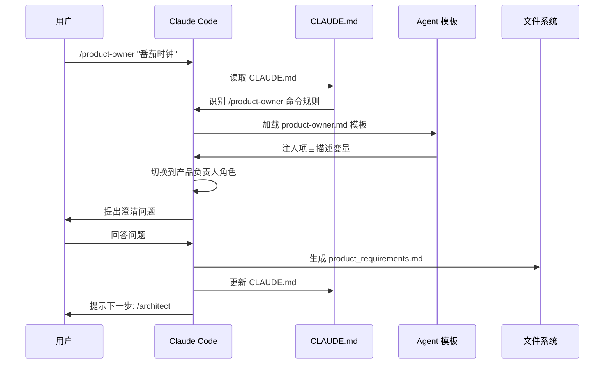

# Claude Code GPT-Pilot 集成系统 v2.0 架构设计

## 📋 目录
1. [系统概述](#系统概述)
2. [核心创新](#核心创新)
3. [技术架构](#技术架构)
4. [实现方案](#实现方案)
5. [文件结构](#文件结构)
6. [开发计划](#开发计划)

---

## 系统概述

### 设计目标

实现一个**完全集成在 Claude Code 内部**的 GPT-Pilot 风格开发系统，用户通过斜杠命令（如 `/product-owner`）直接调用专业 Agent，无需外部脚本或复制粘贴。

### 核心特性

✅ **一键初始化**: `claudecode-gpt init` 创建完整项目结构  
✅ **斜杠命令**: 在 Claude Code 中直接使用 `/agent-name`  
✅ **即时交互**: 命令执行后立即进入 Agent 角色  
✅ **自动文档**: Agent 自动生成和更新项目文档  
✅ **上下文连续**: Agent 间自动共享项目状态  

---

## 核心创新

### 🎯 CLAUDE.md 智能约定系统

**核心思路**: 不依赖外部 hooks 或 MCP Server，而是通过精心设计的 `CLAUDE.md` 文件，让 Claude 自动识别和执行斜杠命令。

#### 工作原理



#### 关键机制

1. **命令识别规则**: CLAUDE.md 中定义每个斜杠命令的触发条件和执行流程
2. **模板自动加载**: 命令触发时自动读取对应的 Agent 提示词模板
3. **变量注入**: 将用户输入注入模板变量（如 {{PROJECT_DESCRIPTION}}）
4. **角色切换**: Claude 立即切换到对应 Agent 角色
5. **文档自动生成**: Agent 完成工作后自动创建/更新文档

---

## 技术架构

### 系统分层

```
┌─────────────────────────────────────────┐
│         用户交互层                        │
│  claudecode-gpt CLI + Claude Code       │
└──────────────┬──────────────────────────┘
               │
┌──────────────▼──────────────────────────┐
│         智能约定层                        │
│  CLAUDE.md (命令规则 + 执行流程)         │
└──────────────┬──────────────────────────┘
               │
┌──────────────▼──────────────────────────┐
│         Agent 模板层                      │
│  7个 Agent 提示词模板 (.md 文件)         │
└──────────────┬──────────────────────────┘
               │
┌──────────────▼──────────────────────────┐
│         上下文管理层                      │
│  context_memory.json + 项目文档          │
└──────────────┬──────────────────────────┘
               │
┌──────────────▼──────────────────────────┐
│         文件系统层                        │
│  项目代码 + 测试 + 文档                   │
└─────────────────────────────────────────┘
```

### 核心组件

#### 1. claudecode-gpt CLI 工具

**功能**: 项目初始化工具

```bash
# 安装
npm install -g claudecode-gpt

# 使用
claudecode-gpt init [项目名称]
```

**执行内容**:
- 创建 `.claude-pilot/` 目录结构
- 生成 7 个 Agent 模板文件
- 创建 CLAUDE.md（包含完整命令规则）
- 初始化 context_memory.json
- 创建基础目录（docs/, src/, tests/, scripts/）
- 生成 README.md 和 .gitignore

#### 2. CLAUDE.md 智能约定文件

**功能**: 定义斜杠命令的识别和执行规则

**关键内容**:
- 每个 Agent 的触发条件
- 执行流程的详细步骤
- 前置条件检查
- 文档生成规范
- 下一步提示

#### 3. Agent 提示词模板

**位置**: `.claude-pilot/templates/`

**模板列表**:
- `product-owner.md` - 需求收集
- `architect.md` - 架构设计
- `tech-lead.md` - 任务分解
- `developer.md` - TDD 开发
- `tester.md` - 测试编写
- `reviewer.md` - 代码审查
- `debugger.md` - 问题诊断

**模板结构**:
```markdown
# {{AGENT_NAME}} Agent

## 角色定义
你现在是 {{ROLE}}，负责 {{RESPONSIBILITY}}。

## 输入
- {{INPUT_VAR_1}}: {{DESCRIPTION}}
- {{INPUT_VAR_2}}: {{DESCRIPTION}}

## 执行流程

### 阶段1: {{PHASE_NAME}}
[详细步骤]

### 阶段2: {{PHASE_NAME}}
[详细步骤]

## 输出要求
1. 创建文件: {{OUTPUT_FILE_1}}
2. 更新文件: {{OUTPUT_FILE_2}}
3. 更新上下文: .claude-pilot/context_memory.json

## 完成检查
- [ ] 检查项1
- [ ] 检查项2

## 下一步提示
完成后请运行: /{{NEXT_AGENT}}
```

#### 4. 上下文管理系统

**context_memory.json 结构**:
```json
{
  "project_name": "Tomato-Clock",
  "created_at": "2025-01-01T00:00:00Z",
  "last_updated": "2025-01-01T00:00:00Z",
  "current_phase": "development",
  "completed_agents": ["product-owner", "architect", "tech-lead"],
  "last_agent": "tech-lead",
  "workflow_stage": "task-execution",
  "important_decisions": [
    {
      "decision": "选择 React + TypeScript + Vite",
      "reason": "类型安全、快速构建、现代化",
      "date": "2025-01-01",
      "agent": "architect"
    }
  ],
  "pending_issues": [],
  "custom_vars": {
    "tech_stack": "React + TypeScript + Vite",
    "test_framework": "Vitest",
    "min_coverage": 80
  }
}
```

---

## 实现方案

### 方案对比

| 特性 | 方案A: CLAUDE.md 约定 | 方案B: MCP Server | 方案C: Hooks |
|------|---------------------|------------------|--------------|
| 实现难度 | ⭐ 简单 | ⭐⭐⭐ 复杂 | ⭐⭐ 中等 |
| 用户体验 | ⭐⭐⭐ 优秀 | ⭐⭐⭐ 优秀 | ⭐⭐ 良好 |
| 可靠性 | ⭐⭐⭐ 高 | ⭐⭐ 中 | ⭐⭐ 中 |
| 维护成本 | ⭐⭐⭐ 低 | ⭐ 高 | ⭐⭐ 中 |
| 扩展性 | ⭐⭐ 中 | ⭐⭐⭐ 高 | ⭐⭐ 中 |
| 即时可用 | ✅ 是 | ❌ 否 | ❌ 否 |

### 推荐方案：A（CLAUDE.md 约定）

**理由**:
1. ✅ 无需额外工具或配置
2. ✅ 完全依赖 Claude 的理解能力
3. ✅ 立即可用，无兼容性问题
4. ✅ 维护简单，只需更新 Markdown 文件
5. ✅ 用户体验流畅

**潜在风险**:
- ⚠️ 依赖 Claude 对 CLAUDE.md 的准确理解
- ⚠️ 需要精心设计命令规则描述

**缓解措施**:
- 使用清晰、明确的语言描述规则
- 提供详细的执行步骤
- 在模板中包含示例
- 定期测试和优化

---

## 文件结构

### 初始化后的项目结构

```
Tomato-Clock/
├── .claude-pilot/              # Agent 系统核心目录
│   ├── agents/
│   │   └── agents.json        # Agent 配置（元数据）
│   ├── templates/             # Agent 提示词模板
│   │   ├── product-owner.md   # 产品负责人模板
│   │   ├── architect.md       # 架构师模板
│   │   ├── tech-lead.md       # 技术主管模板
│   │   ├── developer.md       # 开发工程师模板
│   │   ├── tester.md          # 测试工程师模板
│   │   ├── reviewer.md        # 代码审查员模板
│   │   └── debugger.md        # 调试专家模板
│   ├── context_memory.json    # 上下文记忆
│   └── README.md              # 系统使用说明
│
├── docs/                      # 文档目录
│   ├── product_requirements.md  # 产品需求（/product-owner 生成）
│   └── architecture.md          # 架构设计（/architect 生成）
│
├── src/                       # 源代码目录
├── tests/                     # 测试文件目录
├── scripts/                   # 工具脚本目录
│
├── tasks.md                   # 任务列表（/tech-lead 生成）
├── task_status.json           # 任务状态（/tech-lead 生成）
├── CLAUDE.md                  # 智能约定文件（核心）
├── README.md                  # 项目说明
├── .gitignore                 # Git 忽略规则
└── package.json               # 项目配置（/architect 生成）
```

---

## 开发计划

### 阶段1: CLI 工具开发（2小时）

**任务**:
- [ ] 创建 `claudecode-gpt` npm 包
- [ ] 实现 `init` 命令
- [ ] 生成项目目录结构
- [ ] 生成 CLAUDE.md 模板
- [ ] 生成 7 个 Agent 模板
- [ ] 初始化配置文件

**输出**:
- `claudecode-gpt` CLI 工具
- 可执行 `claudecode-gpt init` 命令

### 阶段2: Agent 模板编写（3小时）

**任务**:
- [ ] 编写 product-owner.md 模板（30分钟）
- [ ] 编写 architect.md 模板（30分钟）
- [ ] 编写 tech-lead.md 模板（30分钟）
- [ ] 编写 developer.md 模板（30分钟）
  - [ ] 单任务模式逻辑
  - [ ] 自动化模式逻辑
  - [ ] 两种模式的区分
- [ ] 编写 tester.md 模板（20分钟）
- [ ] 编写 reviewer.md 模板（20分钟）
- [ ] 编写 debugger.md 模板（20分钟）

**输出**:
- 7 个完整的 Agent 提示词模板

### 阶段3: CLAUDE.md 设计（1.5小时）

**任务**:
- [ ] 设计命令识别规则
- [ ] 编写 `/developer` 单任务模式流程
- [ ] 编写 `/developer-auto` 自动化模式流程
- [ ] 定义前置条件检查
- [ ] 设计文档生成规范
- [ ] 编写使用说明

**输出**:
- 完整的 CLAUDE.md 模板（包含自动化功能）

### 阶段4: 自动化功能增强（2.5小时）

**任务**:
- [ ] 设计循环控制逻辑（30分钟）
- [ ] 设计依赖检查机制（30分钟）
- [ ] 设计进度显示格式（30分钟）
- [ ] 设计错误处理流程（30分钟）
- [ ] 编写自动化模式文档（30分钟）

**输出**:
- 完整的自动化执行逻辑
- 错误处理机制
- 进度追踪系统

### 阶段5: 测试和优化（2小时）

**任务**:
- [ ] 创建测试项目
- [ ] 测试单任务模式工作流
- [ ] 测试自动化模式工作流
- [ ] 测试错误处理场景
- [ ] 测试依赖管理
- [ ] 优化命令描述
- [ ] 修复发现的问题
- [ ] 编写使用文档

**输出**:
- 经过测试的完整系统
- 使用文档和示例
- 最佳实践指南

### 总计: 11小时

**时间分配**:
- 基础功能: 7小时
- 自动化增强: 4小时

---

## 下一步

等待用户确认方案后，将进入 **PLAN 模式（Ω₃）** 制定详细的模块化开发计划。

