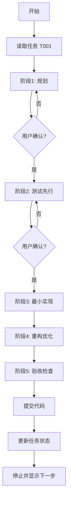
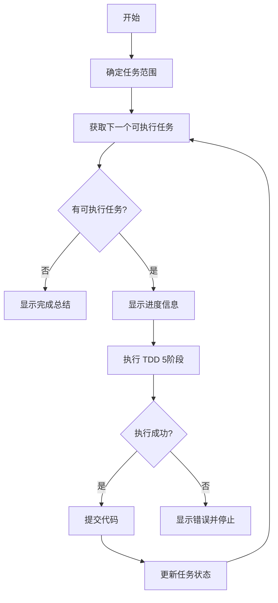
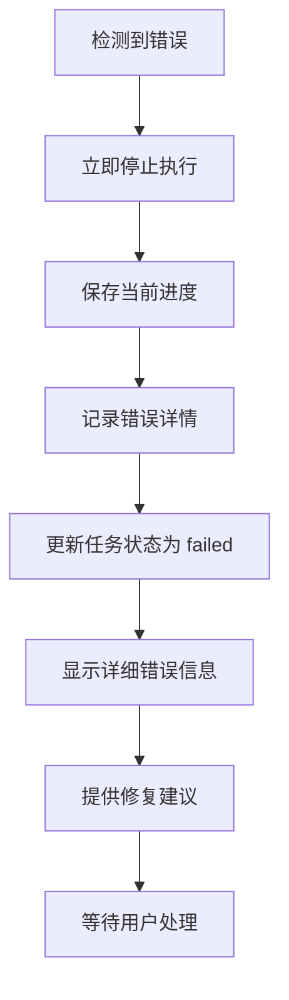

# 自动化批量执行功能设计文档

## 📋 功能概述

在原有单任务执行模式的基础上，新增**自动化批量执行模式**，允许开发者一次性执行多个任务，大幅提升开发效率。

---

## 🎯 设计目标

1. **保留灵活性**: 保持原有的单任务模式，适合需要人工监督的复杂任务
2. **提升效率**: 新增自动化模式，适合批量执行简单任务
3. **安全可靠**: 遇到错误立即停止，避免错误扩散
4. **进度可见**: 实时显示执行进度和状态
5. **易于恢复**: 错误后可以从失败点继续执行

---

## 🔄 两种执行模式对比

| 特性 | 单任务模式 | 自动化模式 |
|------|-----------|-----------|
| **命令** | `/developer T001` | `/developer-auto T001` |
| **执行范围** | 单个任务 | 多个任务（连续） |
| **用户确认** | 每阶段等待确认 | 不等待（除非出错） |
| **适用场景** | 复杂任务、需要监督 | 简单任务、批量执行 |
| **错误处理** | 显示错误，等待修复 | 立即停止，报告详情 |
| **进度显示** | 当前任务状态 | 整体进度 + 当前任务 |
| **完成后** | 停止，显示下一步 | 继续下一个任务 |

---

## 💻 命令详解

### 1. 单任务模式

#### 命令格式
```
/developer T001
/dev T001
```

#### 执行流程


#### 示例输出
```
✅ 任务 T001 完成！

📊 任务统计:
- 文件创建: 3 个
- 文件修改: 2 个
- 测试用例: 8 个
- 代码覆盖率: 87%

📝 下一个任务: T002 - 实现计时器暂停功能

选择操作:
- /developer T002  (手动执行下一个任务)
- /reviewer T001   (代码审查当前任务)
- /next-task       (查看下一个任务详情)
- /developer-auto T002  (从下一个任务开始自动执行)
```

---

### 2. 自动化批量执行模式

#### 命令格式

**从指定任务开始**:
```
/developer-auto T001
/dev-auto T001
```

**从第一个 pending 任务开始**:
```
/developer-auto
/dev-auto
```

**执行指定范围**:
```
/developer-auto T005-T010
/dev-auto T005-T010
```

#### 执行流程


#### 进度显示示例
```
🔄 自动化执行进度: 3/15
📋 当前任务: T003 - 实现计时器暂停功能
⏱️  预计时间: 2小时
🔗 依赖: T001, T002 (已完成)

【阶段1】规划完成 ✓
【阶段2】测试先行完成 ✓
【阶段3】最小实现中...
```

#### 成功完成示例
```
🎉 自动化执行完成！

📊 执行统计:
- 总任务数: 15
- 成功完成: 15
- 总耗时: 18小时
- 代码提交: 15次
- 平均测试覆盖率: 86%

📝 已完成任务:
✅ T001 - 项目基础配置
✅ T002 - 实现计时器核心逻辑
✅ T003 - 实现计时器暂停功能
... (共15个)

📝 下一步建议:
- /task-list  (查看所有任务状态)
- /reviewer T001  (开始代码审查)
- /status  (查看项目整体状态)
```

#### 错误停止示例
```
❌ 自动化执行在任务 T005 失败

📋 失败任务: T005 - 实现数据持久化
🔴 失败阶段: 阶段3 - 最小实现
📄 错误信息:
  TypeError: Cannot read property 'getItem' of undefined
  at src/utils/storage.ts:15:23

  Stack trace:
  at Storage.get (src/utils/storage.ts:15:23)
  at useLocalStorage (src/hooks/useLocalStorage.ts:8:15)

📊 执行统计:
  - 已完成: 4/15 任务
  - 成功: T001, T002, T003, T004
  - 失败: T005
  - 剩余: T006-T015 (未执行)

🔧 建议操作:
  1. 检查 localStorage API 的使用
  2. 添加环境检查（浏览器环境 vs Node 环境）
  3. 运行 /developer T005 手动修复
  4. 或运行 /debugger "localStorage undefined" 进入调试模式
  5. 修复后运行 /developer-auto T005 继续自动执行
```

---

## 🔍 依赖管理

### 依赖检查机制

自动化模式会自动检查任务依赖关系：

```json
// task_status.json 示例
{
  "tasks": [
    {
      "id": "T001",
      "title": "项目基础配置",
      "dependencies": [],
      "status": "completed"
    },
    {
      "id": "T002",
      "title": "实现计时器核心",
      "dependencies": ["T001"],
      "status": "completed"
    },
    {
      "id": "T003",
      "title": "实现暂停功能",
      "dependencies": ["T002"],
      "status": "pending"
    },
    {
      "id": "T004",
      "title": "实现重置功能",
      "dependencies": ["T002"],
      "status": "pending"
    },
    {
      "id": "T005",
      "title": "集成所有功能",
      "dependencies": ["T003", "T004"],
      "status": "pending"
    }
  ]
}
```

### 执行顺序

基于上述依赖关系，自动化模式的执行顺序：

```
1. T003 和 T004 可以并行执行（都只依赖 T002）
   → 实际执行：先 T003，再 T004（顺序执行）
   
2. T005 必须等待 T003 和 T004 都完成
   → 检查依赖，确认后执行
```

### 依赖未满足处理

如果遇到依赖未满足的情况：

```
⚠️ 任务 T005 依赖未满足

📋 任务: T005 - 集成所有功能
🔗 依赖要求:
  - T003 (实现暂停功能) - ✅ 已完成
  - T004 (实现重置功能) - ❌ 未完成

📊 当前状态:
  - 已完成: T001, T002, T003
  - 进行中: 无
  - 待办: T004, T005, T006...

🔧 操作建议:
  - 先执行 /developer T004
  - 或运行 /developer-auto T004 继续自动执行
```

---

## 🛡️ 错误处理策略

### 错误类型

1. **编译错误**: TypeScript 编译失败
2. **测试失败**: 单元测试或集成测试失败
3. **Lint 错误**: ESLint 检查失败
4. **覆盖率不足**: 测试覆盖率低于阈值
5. **运行时错误**: 代码执行时抛出异常

### 处理流程



### 错误恢复

用户修复错误后，可以选择：

1. **从失败任务重新开始**:
   ```
   /developer-auto T005
   ```

2. **手动执行失败任务**:
   ```
   /developer T005
   ```

3. **进入调试模式**:
   ```
   /debugger "错误描述"
   ```

---

## 📊 进度追踪

### 实时进度显示

```
🔄 自动化执行进度: 7/20 (35%)

📋 当前任务: T007 - 实现通知功能
⏱️  预计时间: 3小时
🔗 依赖: T005, T006 (已完成)

【阶段1】规划 ✓ (2分钟)
【阶段2】测试先行 ✓ (5分钟)
【阶段3】最小实现 ⏳ (进行中...)
【阶段4】重构优化 ⏸️ (等待)
【阶段5】验收检查 ⏸️ (等待)

📈 整体统计:
- 已完成: 6 任务
- 进行中: 1 任务
- 待执行: 13 任务
- 总进度: 35%
- 预计剩余时间: 26小时
```

### 任务状态更新

每个任务完成后，自动更新 `task_status.json`:

```json
{
  "id": "T007",
  "status": "completed",
  "started_at": "2025-01-01T10:00:00Z",
  "completed_at": "2025-01-01T13:15:00Z",
  "actual_hours": 3.25,
  "test_coverage": 88,
  "files_created": 4,
  "files_modified": 2,
  "commit_hash": "a1b2c3d"
}
```

---

## 🎯 使用场景

### 场景1: 快速原型开发

**需求**: 快速实现 MVP 的所有基础功能

**操作**:
```
/tech-lead  # 生成任务列表
/developer-auto  # 自动执行所有任务
```

**优势**: 无需人工干预，快速完成基础功能

---

### 场景2: 批量修复简单任务

**需求**: 修复多个简单的 bug 或实现多个小功能

**操作**:
```
/developer-auto T010-T020  # 只执行 T010 到 T020
```

**优势**: 集中处理简单任务，提高效率

---

### 场景3: 复杂功能开发

**需求**: 实现复杂功能，需要仔细监督

**操作**:
```
/developer T001  # 手动执行，每步确认
```

**优势**: 可以在每个阶段检查和调整

---

### 场景4: 混合模式

**需求**: 部分任务自动执行，部分手动执行

**操作**:
```
/developer-auto T001-T005  # 自动执行简单任务
/developer T006  # 手动执行复杂任务
/developer-auto T007-T010  # 继续自动执行
```

**优势**: 灵活组合，兼顾效率和质量

---

## 🔧 实现要点

### 1. 循环控制逻辑

```javascript
// 伪代码
async function autoExecuteTasks(startTaskId, endTaskId) {
  const tasks = loadTasksInRange(startTaskId, endTaskId);
  let completedCount = 0;
  
  for (const task of tasks) {
    // 检查依赖
    if (!checkDependencies(task)) {
      console.log(`跳过 ${task.id}: 依赖未满足`);
      continue;
    }
    
    // 显示进度
    displayProgress(completedCount, tasks.length, task);
    
    try {
      // 执行 TDD 5阶段
      await executeTDDPhases(task, 'auto_mode');
      
      // 提交代码
      await gitCommit(task);
      
      // 更新状态
      updateTaskStatus(task.id, 'completed');
      completedCount++;
      
    } catch (error) {
      // 错误处理
      displayError(task, error);
      saveProgress(completedCount);
      break;  // 停止执行
    }
  }
  
  // 显示总结
  displaySummary(completedCount, tasks.length);
}
```

### 2. 错误捕获

```javascript
// 在每个关键步骤添加错误捕获
try {
  await runTests();
} catch (error) {
  throw new TaskExecutionError('测试失败', {
    phase: '阶段3',
    taskId: task.id,
    error: error
  });
}
```

### 3. 进度持久化

```json
// .claude-pilot/auto_execution_state.json
{
  "mode": "auto",
  "start_task": "T001",
  "end_task": "T020",
  "current_task": "T007",
  "completed_tasks": ["T001", "T002", "T003", "T004", "T005", "T006"],
  "failed_task": null,
  "started_at": "2025-01-01T10:00:00Z",
  "last_updated": "2025-01-01T13:15:00Z"
}
```

---

## ✅ 开发计划更新

在原有 7小时开发计划基础上，增加自动化功能开发：

| 任务 | 时间 | 说明 |
|------|------|------|
| 更新 CLAUDE.md | 30分钟 | 添加 /developer-auto 命令定义 |
| 更新 developer.md 模板 | 1小时 | 区分两种模式，添加循环逻辑 |
| 实现循环控制逻辑 | 1小时 | 任务遍历、依赖检查、错误处理 |
| 实现进度显示 | 30分钟 | 实时进度、统计信息 |
| 测试自动化模式 | 1小时 | 完整流程测试、错误场景测试 |
| **总计** | **4小时** | |

**更新后总开发时间**: 7 + 4 = **11小时**

---

## 📝 总结

自动化批量执行功能的加入，使得系统具备了：

✅ **灵活性**: 单任务和批量执行两种模式  
✅ **高效性**: 批量执行大幅提升开发速度  
✅ **安全性**: 错误立即停止，避免扩散  
✅ **可见性**: 实时进度和详细统计  
✅ **可恢复性**: 错误后可从失败点继续  

这将极大提升开发者的工作效率，特别是在处理大量简单任务时。

