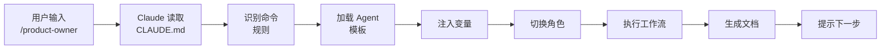

# Claude Code GPT-Pilot 集成系统 v2.0 - 方案总结

## 📋 执行摘要

本方案设计了一个**完全集成在 Claude Code 内部**的 GPT-Pilot 风格开发系统，通过智能约定机制实现斜杠命令调用专业 Agent，无需外部脚本或复制粘贴操作。

---

## 🎯 核心目标

实现以下用户体验：

```bash
# 第一步：初始化项目
mkdir Tomato-Clock && cd Tomato-Clock
claudecode-gpt init

# 第二步：启动 Claude Code
claude

# 第三步：直接使用斜杠命令
/product-owner "我要开发一个番茄时钟app"
/architect
/tech-lead
/developer T001
/reviewer T001
```

**关键特性**：
- ✅ 一键初始化完整项目结构
- ✅ 在 Claude Code 内直接使用斜杠命令
- ✅ 即时进入 Agent 角色，无需复制粘贴
- ✅ 自动生成和更新项目文档
- ✅ Agent 间自动共享上下文

---

## 🏗️ 技术架构

### 核心创新：CLAUDE.md 智能约定系统

**原理**：通过精心设计的 `CLAUDE.md` 文件，定义每个斜杠命令的识别规则和执行流程，让 Claude 自动识别并执行相应的 Agent 工作流。

### 工作流程



### 系统组件

```
┌─────────────────────────────────────────┐
│  claudecode-gpt CLI                     │
│  • 项目初始化                            │
│  • 生成目录结构                          │
│  • 创建配置文件                          │
└──────────────┬──────────────────────────┘
               │
┌──────────────▼──────────────────────────┐
│  CLAUDE.md 智能约定                      │
│  • 命令识别规则                          │
│  • 执行流程定义                          │
│  • 前置条件检查                          │
└──────────────┬──────────────────────────┘
               │
┌──────────────▼──────────────────────────┐
│  Agent 提示词模板库                      │
│  • product-owner.md                     │
│  • architect.md                         │
│  • tech-lead.md                         │
│  • developer.md                         │
│  • tester.md                            │
│  • reviewer.md                          │
│  • debugger.md                          │
└──────────────┬──────────────────────────┘
               │
┌──────────────▼──────────────────────────┐
│  上下文管理系统                          │
│  • context_memory.json                  │
│  • 项目文档自动关联                      │
│  • 决策记录追踪                          │
└─────────────────────────────────────────┘
```

---

## 📁 项目结构

```
Tomato-Clock/
├── .claude-pilot/              # Agent 系统核心
│   ├── agents/
│   │   └── agents.json        # Agent 元数据配置
│   ├── templates/             # 7个 Agent 提示词模板
│   │   ├── product-owner.md
│   │   ├── architect.md
│   │   ├── tech-lead.md
│   │   ├── developer.md
│   │   ├── tester.md
│   │   ├── reviewer.md
│   │   └── debugger.md
│   ├── context_memory.json    # 上下文记忆
│   └── README.md              # 系统说明
│
├── docs/                      # 自动生成的文档
│   ├── product_requirements.md
│   └── architecture.md
│
├── src/                       # 源代码
├── tests/                     # 测试文件
├── scripts/                   # 工具脚本
│
├── tasks.md                   # 任务列表
├── task_status.json           # 任务状态
├── CLAUDE.md                  # 智能约定文件（核心）
├── README.md                  # 项目说明
└── .gitignore                 # Git 配置
```

---

## 🎭 7个专业 Agent

| Agent | 命令 | 职责 | 输入 | 输出 |
|-------|------|------|------|------|
| 🎯 产品负责人 | `/product-owner` | 需求收集和分析 | 项目描述 | product_requirements.md |
| 🏗️ 软件架构师 | `/architect` | 技术选型和架构设计 | 产品需求 | architecture.md, 项目结构 |
| 📋 技术主管 | `/tech-lead` | 任务分解和规划 | 需求+架构 | tasks.md, task_status.json |
| 💻 开发工程师 | `/developer` | TDD 功能实现 | 任务ID | 代码 + 测试 |
| 🧪 测试工程师 | `/tester` | 测试编写 | 任务ID | 测试套件 |
| 👀 代码审查员 | `/reviewer` | 代码审查 | 任务ID | 审查报告 |
| 🔧 调试专家 | `/debugger` | 问题诊断 | 错误描述 | 诊断 + 修复 |

---

## 🔄 完整工作流程

### 示例：开发番茄时钟应用

```bash
# 1. 初始化项目
mkdir Tomato-Clock && cd Tomato-Clock
claudecode-gpt init

# 2. 启动 Claude Code
claude
```

**在 Claude Code 中：**

```
# 3. 需求收集
/product-owner "我要开发一个番茄时钟应用，帮助用户提高专注力"

[Product Owner Agent 提出 5-7 个问题]
[用户回答所有问题]
[自动生成 docs/product_requirements.md]

# 4. 架构设计
/architect

[Architect Agent 提供技术栈方案]
[用户选择方案（如 React + TypeScript + Vite）]
[自动生成项目结构、配置文件、docs/architecture.md]

# 5. 任务分解
/tech-lead

[Tech Lead Agent 分析需求和架构]
[自动生成 tasks.md 和 task_status.json]

# 6. 迭代开发
/next-task
# 显示: T001 - 项目基础配置

/developer T001

[Developer Agent 执行 TDD 5阶段流程]
[自动生成代码和测试]
[自动提交到 Git]

# 7. 代码审查
/reviewer T001

[Reviewer Agent 审查代码]
[生成审查报告]
[如果通过，更新任务状态]

# 8. 重复步骤 6-7 直到所有任务完成
/next-task
/developer T002
/reviewer T002
...
```

---

## 💡 关键优势

### vs 原方案（外部脚本）

| 特性 | 原方案 | 新方案 v2.0 |
|------|--------|------------|
| 命令执行 | 外部脚本生成提示词 | Claude Code 内置命令 |
| 用户操作 | 复制粘贴到 Claude Code | 直接输入斜杠命令 |
| 工作流程 | 多步骤（脚本→复制→粘贴） | 一步到位 |
| 上下文切换 | 需要在终端和 Claude Code 间切换 | 全程在 Claude Code 内 |
| 学习曲线 | 需要理解脚本系统 | 直观的斜杠命令 |
| 维护成本 | 需要维护外部脚本 | 只需维护 Markdown 文件 |

### 核心优势

1. **🚀 极致流畅的用户体验**
   - 无需离开 Claude Code
   - 无需复制粘贴
   - 一个命令完成所有操作

2. **🎯 零学习成本**
   - 直观的斜杠命令
   - 清晰的提示和引导
   - 自动的下一步建议

3. **🔧 简单的实现和维护**
   - 无需外部工具或服务
   - 纯 Markdown 配置
   - 易于理解和修改

4. **📚 完整的文档自动化**
   - 需求文档自动生成
   - 架构文档自动生成
   - 任务列表自动生成
   - 上下文自动追踪

5. **🔄 连续的开发体验**
   - Agent 间无缝衔接
   - 上下文自动传递
   - 进度自动追踪

---

## ⚠️ 潜在风险和缓解措施

### 风险1: 依赖 Claude 的理解能力

**风险描述**: CLAUDE.md 的命令规则需要 Claude 准确理解和执行

**缓解措施**:
- ✅ 使用清晰、明确、无歧义的语言
- ✅ 提供详细的分步执行流程
- ✅ 在模板中包含示例和说明
- ✅ 充分测试和优化描述

### 风险2: 命令识别可能不稳定

**风险描述**: Claude 可能无法 100% 准确识别斜杠命令

**缓解措施**:
- ✅ 在 CLAUDE.md 中明确标注命令格式
- ✅ 提供命令别名（如 `/po` = `/product-owner`）
- ✅ 在每个 Agent 完成后明确提示下一个命令
- ✅ 提供 `/status` 命令查看当前可用命令

### 风险3: 文档生成可能不一致

**风险描述**: 不同会话可能生成格式不一致的文档

**缓解措施**:
- ✅ 在模板中提供完整的文档结构
- ✅ 明确指定文件路径和格式
- ✅ 在 CLAUDE.md 中定义文档规范
- ✅ 提供文档模板和示例

---

## 📊 开发计划

### 总体时间估算：7小时

| 阶段 | 任务 | 时间 | 输出 |
|------|------|------|------|
| **阶段1** | CLI 工具开发 | 2h | claudecode-gpt 命令 |
| **阶段2** | Agent 模板编写 | 3h | 7个完整模板 |
| **阶段3** | CLAUDE.md 设计 | 1h | 智能约定文件 |
| **阶段4** | 测试和优化 | 1h | 完整可用系统 |

### 详细任务分解

**阶段1: CLI 工具开发（2小时）**
- [ ] 创建 npm 包结构
- [ ] 实现 `init` 命令
- [ ] 生成目录结构逻辑
- [ ] 模板文件复制逻辑
- [ ] 变量替换功能
- [ ] 命令行参数处理

**阶段2: Agent 模板编写（3小时）**
- [ ] product-owner.md（30分钟）
- [ ] architect.md（30分钟）
- [ ] tech-lead.md（30分钟）
- [ ] developer.md（30分钟）
- [ ] tester.md（20分钟）
- [ ] reviewer.md（20分钟）
- [ ] debugger.md（20分钟）

**阶段3: CLAUDE.md 设计（1小时）**
- [ ] 命令识别规则编写
- [ ] 执行流程说明
- [ ] 前置条件定义
- [ ] 使用说明和示例
- [ ] 辅助命令设计

**阶段4: 测试和优化（1小时）**
- [ ] 创建测试项目
- [ ] 完整流程测试
- [ ] 问题修复
- [ ] 文档完善
- [ ] 示例项目创建

---

## ✅ 确认检查清单

在开始开发前，请确认：

- [ ] **架构设计**: CLAUDE.md 智能约定系统是否可行？
- [ ] **用户体验**: 斜杠命令的交互方式是否符合预期？
- [ ] **技术实现**: 纯 Markdown 配置的方案是否可接受？
- [ ] **文件结构**: `.claude-pilot/` 目录结构是否合理？
- [ ] **Agent 设计**: 7个 Agent 的职责划分是否清晰？
- [ ] **工作流程**: 从初始化到开发的完整流程是否流畅？
- [ ] **扩展性**: 未来是否需要添加其他 Agent 或功能？

---

## 🚀 下一步行动

**等待您的确认**：

1. **方案认可**: 这个基于 CLAUDE.md 智能约定的方案是否符合您的预期？

2. **调整需求**: 是否有需要调整或补充的地方？

3. **开始信号**: 如果方案确认无误，请明确表示 **"确认开始开发"**

确认后，我将：
1. 进入 **PLAN 模式（Ω₃）** 制定详细的模块化开发计划
2. 进入 **EXECUTE 模式（Ω₄）** 开始实现系统
3. 按照 AugmentRIPER♦Σ 框架的规范进行开发

---

**期待您的反馈！** 🎯

